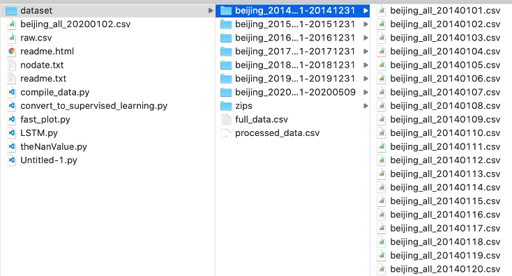
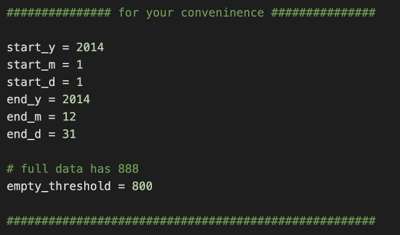
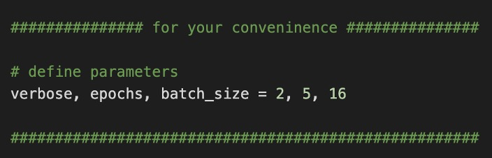

# 简介

本Repository主要采用了 LSTM 的方法来完成未来 1-6 小时逐小时多个观测点的 PM2.5 等级，准确率可达到96%。

PM2.5 等级的分类如下：

|     PM2.5 等级        |     PM2.5 数值               |
|-----------------------|------------------------------|
|     一级(优)          |     0∼35 g/m3                |
|     二级(良)          |     35∼75 g/m3               |
|     三级(轻度污染)    |     75∼115 g/m3              |
|     四级(中度污染)    |     115∼150 g/m3             |
|  五级(重度污染)       |     150∼250 g/m3             |
|  六级(严重污染)       |     大于 250 g/m3 及以上     |

主要的改进方法是对PM2.5等级作one hot encoding，以及Attention Based LSTM。

| PM2.5 等级     | one hot encode |
|----------------|----------------|
| 一级(优)       | [1,0,0,0,0,0]  |
| 二级(良)       | [0,1,0,0,0,0]  |
| 三级(轻度污染) | [0,0,1,0,0,0]  |
| 四级(中度污染) | [0,0,0,1,0,0]  |
| 五级(重度污染) | [0,0,0,0,1,0]  |
| 六级(严重污染) | [0,0,0,0,0,1]  |

LSTM 是一个非常有用的模型，但它也是一个非常精细的模型。在使用之前，我们最好先思 考，输入、输出数据的样子，如果数据适合使用 one hot encoding 来表征的话，那就是再好 不过的事。我这里训练出来的 LSTM 效果极佳，最好可以到 0.962 的整体准确率，据说清华大学班上的学生也还没有达到过这么高的成绩。我想在之后的时间可以研究看看是否可以让 ABLSTM 达到更好的效果，毕竟我们知道 Attention based LSTM 是近年来非常潜力的一种模型，但由于模 型较为复杂，使用的人还是不多的。

在特征选择上，我们往往会觉得要越多越好，其实倒也未必，像在这个如此高准确率的模型 里，我也只用了区区 PM2.5 的数据。再来，也有看到在网上的一些讨论，他们认为在 LSTM 进行 K折交叉验证是有不好的影响的，这个我也是认同的，毕竟 LSTM 还是必须要依照时间 顺序来输入，才会有更好的效果的。

再者，有一点值得再做进一步改进的，我觉得是让输入⻓度达到更多的变化，这个在 LSTM 模型这里不会很困难，但是在数据处理上却会是非常大工程的。如果这一个工作能够完成，则 我们的 LSTM 模型就能够“吃”更多样化的数据了，也可以预想到的就是，吃的时间⻓度越⻓ 的数据，则预测的准确度就越准确，而且这在真实应用的时候，也会达到更好的灵活性。

我是医学院的学生，主要的研究项目是脑机接口。在脑机接口的领域中，有个叫做运动想象的 领域，就是侦测了一个人的脑波，然后我们需要判断他想的是什么动作，这是一个分类问题。 而我觉得对于这样的脑波的时序信号，LSTM 也必定可以发挥很好的作用，在这次实践过程中 虽然是没日没夜的，但也是获益匪浅的，相信在未来的研究生道路上会更加顺逐!

要是代码有问题，也请联系我。

# 数据准备

## 数据来源
采用的是北京官方的数据，可从[这里](https://cloud.tsinghua.edu.cn/f/eb2b04a1da7f4d0c9810/?dl=1)下载。

## 整理代码
系统要求：Keras 2.3.1、Python 3.7.4

首先让terminal cd到主要的文件夹，再逐条依照下面的指示，各跑一次模型。

$ python3 compile_data.py

生成一个2014年1月到12月的数据，以供模型训练。
如果要最好的效果，可以把2014年到2020年的未处理过的数据放到里面，请依照这样的格式摆放数据。2020年的编码方式目前是最多只能读到20200509。

然后可在代码第45行这里设定你想要的数据区间，可跨年、跨月。目前只含括了所附上的数据，就是由2014年1月1日至2014年12月31日的数据。

# 主要模型代码

## Encoder-decoder seq2seq LSTM的训练

$ python3 LSTM.py

代码设定只跑5个epoch。

## Encoder-decoder seq2seq Attention based LSTM的训练

$ python3 ABLSTM.py

代码设定只跑5个epoch。

 
如果要有最好的效果可以跑10个epoch，这里第27行这里更改

## 最优的模型与其权重

最有模型及权重已经以.hf以及.json存储到model的文件夹当中，ABLSTM的文件是：ABLSTM_best.h5、ABLSTM_best.json；LSTM的文件则是：basic_lstm_model_best.h5、basic_lstm_model_best.json.

如果想要直接检测最优模型，可以执行下面的代码：

$ python3 test_best_model.py

如有需要个别运行到外面的代码，可按照以下的代码把模型给载入：
## ABLSTM 模型
json_file = open('model/ABLSTM_best.json', 'r')
loaded_model_json = json_file.read()
json_file.close()
ABLSTM_model = model_from_json(loaded_model_json)
ABLSTM_model.load_weights('model/ABLSTM_best.h5')
print("Loaded ablstm model from disk")

## LSTM 模型
json_file = open('model/basic_lstm_model_best.json', 'r')
loaded_model_json = json_file.read()
json_file.close()
LSTM_model = model_from_json(loaded_model_json)
LSTM_model.load_weights('model/basic_lstm_model_best.h5')
print("Loaded lstm model from disk")

# 实验代码

## “后分类”的LSTM

首先生成数据相关数据

$ python3 compile_data_with_time.py

然后执行

$ python3 LSTM_after_categorize.py

代码设定只跑5个epoch，如要有最好的效果，可以跑5个epoch。

## “对于突变的应变能力”、“各个时间点上的准确率”

“对于突变的应变能力”以及“各个时间点上的准确率”的代码都写到一起了，跑了前面说的compile_data.py再跑下面的code这个就能显示结果了。

$ python3 calculate_various_accuracy.py
